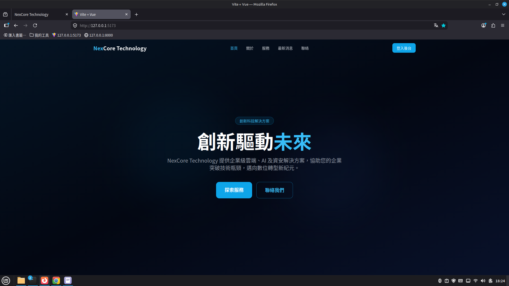
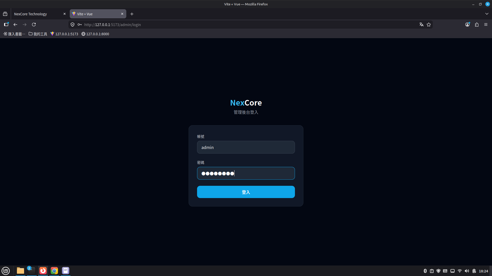
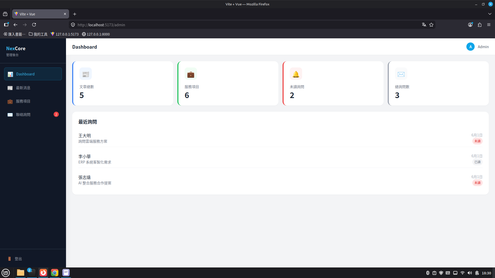
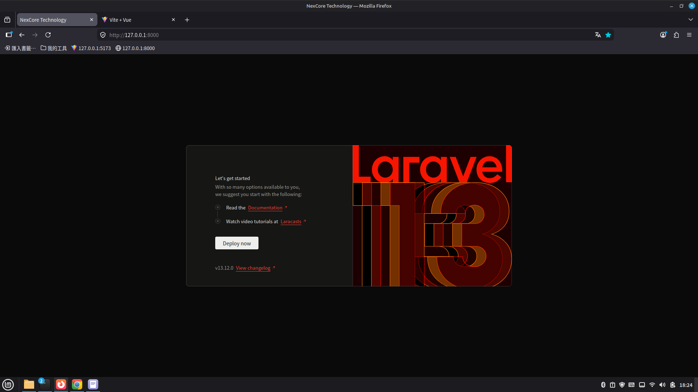

# NexCore Technology — Demo 網站

NexCore Technology 虛構科技公司的前後端分離展示網站。前台展示公司服務、消息及聯絡功能；後台提供內容管理。

## 畫面截圖

### 前台首頁


### 後台登入


### 後台 Dashboard


### REST API


## 技術架構

| 層級 | 技術 |
|------|------|
| 前端 | Vue 3 + Vite + Pinia + Vue Router + Tailwind CSS |
| 後端 | Laravel 13 (API-only) + Laravel Sanctum |
| 資料庫 | SQLite |
| 認證 | Sanctum Token 認證 |

## 系統需求

- PHP 8.3+
- Composer 2.7+
- Node.js 18+
- npm 9+

## 安裝步驟

### 後端

```bash
cd backend

# 安裝依賴
composer install

# 建立必要的 storage 目錄
mkdir -p storage/framework/cache/data
mkdir -p storage/framework/sessions
mkdir -p storage/framework/views
mkdir -p storage/logs
chmod -R 775 storage

# 設定環境
cp .env.example .env
php artisan key:generate

# 建立資料庫與假資料
php artisan migrate:fresh --seed
```

### 前端

```bash
cd frontend
npm install
```

## 環境設定

### 後端 `.env` 關鍵欄位

```env
APP_NAME="NexCore Technology"
APP_URL=http://localhost:8000
DB_CONNECTION=sqlite
SANCTUM_STATEFUL_DOMAINS=localhost:5173
SESSION_DOMAIN=localhost
```

### 前端 `.env.local`

```env
VITE_API_BASE_URL=http://localhost:8000
```

## 啟動步驟

開啟兩個終端機視窗分別執行：

### 終端機 1 — 後端

```bash
cd backend
php artisan serve --port=8000
```

### 終端機 2 — 前端

```bash
cd frontend
npm run dev
```

瀏覽器開啟：

| 網址 | 說明 |
|------|------|
| http://localhost:5173 | 前台網站 |
| http://localhost:5173/admin/login | 後台登入 |

## 測試帳號

| 帳號 | 密碼 |
|------|------|
| admin | directx9 |
| admin@nexcore.com | directx9 |

## API 端點列表

### 公開端點

| 方法 | 路徑 | 說明 |
|------|------|------|
| POST | /api/login | 登入，回傳 token |
| GET | /api/news | 取得已發布新聞列表 |
| GET | /api/news/{slug} | 取得單篇新聞 |
| GET | /api/services | 取得啟用服務列表 |
| POST | /api/contacts | 送出聯絡表單 |

### 需要認證（Bearer Token）

| 方法 | 路徑 | 說明 |
|------|------|------|
| POST | /api/logout | 登出 |
| GET | /api/me | 取得當前使用者 |
| GET | /api/admin/dashboard | 儀表板統計 |
| GET | /api/admin/news | 管理員取得所有文章 |
| POST | /api/admin/news | 新增文章 |
| PUT | /api/admin/news/{id} | 更新文章 |
| DELETE | /api/admin/news/{id} | 刪除文章 |
| POST | /api/admin/services | 新增服務 |
| PUT | /api/admin/services/{id} | 更新服務 |
| DELETE | /api/admin/services/{id} | 刪除服務 |
| GET | /api/admin/contacts | 取得所有詢問 |
| PATCH | /api/admin/contacts/{id}/read | 標記詢問為已讀 |

## 前台頁面路徑

| 路徑 | 說明 |
|------|------|
| / | 首頁（Hero、服務亮點、最新消息、統計） |
| /about | 關於我們（公司介紹、核心價值、團隊） |
| /services | 服務項目（所有服務卡片） |
| /news | 新聞列表 |
| /news/:slug | 新聞詳細頁 |
| /contact | 聯絡表單 |

## 後台頁面路徑

| 路徑 | 說明 |
|------|------|
| /admin/login | 管理員登入 |
| /admin | Dashboard（統計卡片、近期詢問） |
| /admin/news | 最新消息 CRUD |
| /admin/services | 服務項目 CRUD |
| /admin/contacts | 聯絡詢問管理（查看、標記已讀） |

## 目錄結構

```
demo/
├── backend/                # Laravel 13 API
│   ├── app/
│   │   ├── Http/Controllers/Api/
│   │   │   ├── AuthController.php
│   │   │   ├── NewsController.php
│   │   │   ├── ServiceController.php
│   │   │   ├── ContactController.php
│   │   │   └── DashboardController.php
│   │   └── Models/
│   ├── database/
│   │   ├── migrations/
│   │   ├── seeders/
│   │   └── database.sqlite
│   └── routes/api.php
└── frontend/               # Vue 3 SPA
    └── src/
        ├── api/            # Axios API modules
        ├── stores/         # Pinia stores
        ├── router/         # Vue Router
        ├── layouts/        # PublicLayout / AdminLayout
        ├── components/
        │   ├── public/     # Navbar, Footer, HeroBanner, ServiceCard
        │   └── admin/      # Sidebar, TopBar, DataTable
        └── views/
            ├── public/     # Home, About, Services, News, Contact
            └── admin/      # Login, Dashboard, News/Services/Contacts Manage
```
